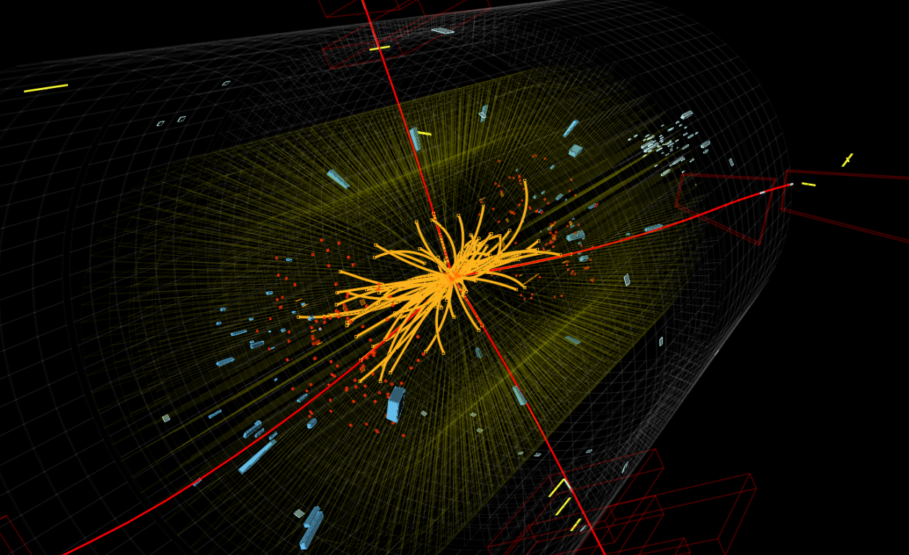
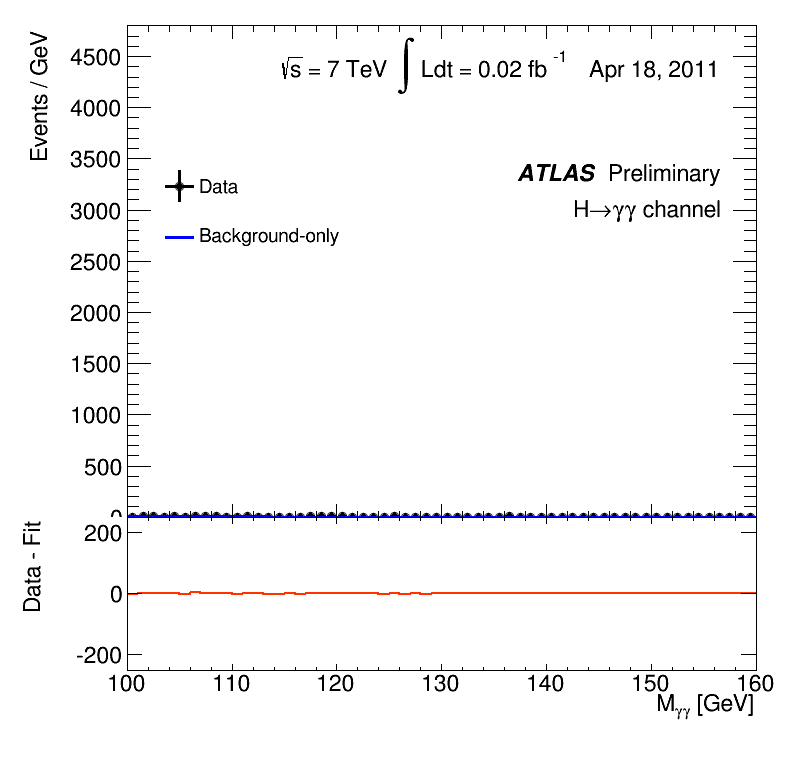

# Higgs Discovery

> Rediscovering the Higgs boson with collision data from the ATLAS and CMS detectors at LHC

## Contents

<!--ts-->
   * [Motivation](#motivation)
   * [Background](#background)
      * [Particle Physics 101](#particle-physics-101)
      * [Higgs boson](#higgs-boson)
      * [Particle collidders](particle-colliders)
      * [LHC](#lhc)
      * [ATLAS](#atlas)
      * [CMS](#cms)
   * [Getting Started](#getting-started)
   * [Work to be done](#work-to-be-done)
   * [Open questions](#open-questions)
   * [Resources](#resources)
   * [References](#references)

<!--te-->

## Motivation
My goal with this project is to fully understand each and every step that let to the discovery of the Higgs boson at the LHC and to independently reproduce it using collision data from the 2011 and 2012 open datasets of the ATLAS and CMS experiments.

Animation of the reconstructed mass from Higgs candidate events in two-photon decays

## Background
### Particle Physics 101
### Higgs boson
### Particle colliders
### LHC
### ATLAS
### CMS
## Getting Started
## Work to be done
## Open questions
## Resources
## References
